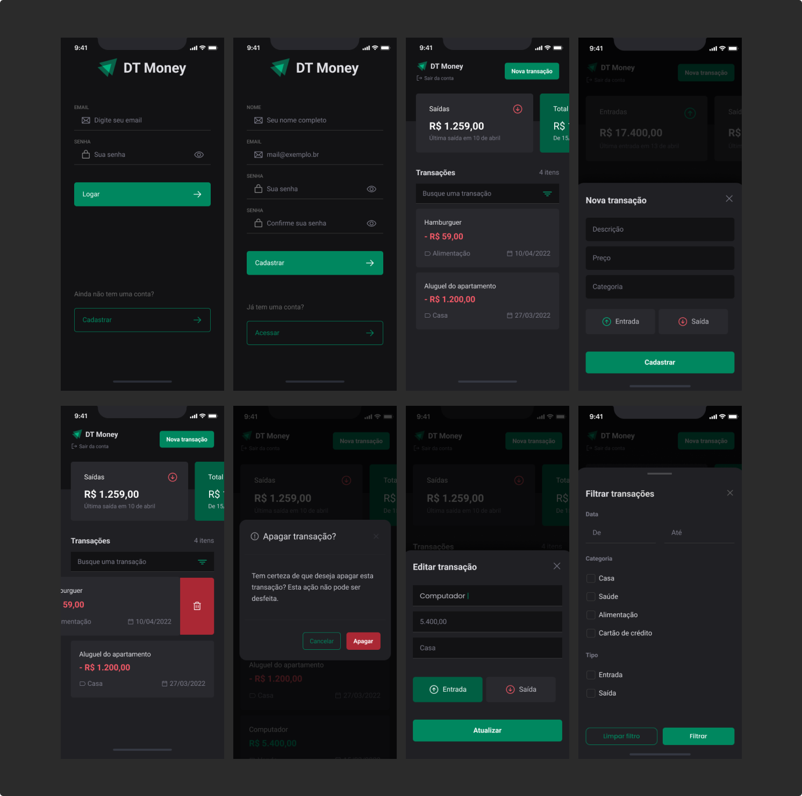

# DtMoney App 💵

&nbsp;

## 📚 Informações sobre o projeto

* O projeto consiste em um aplicativo de gerenciamento de finanças pessoais, onde o usuário cria sua conta, faz o seu login e cria transações (entradas e saídas) associadas a uma categoria. Ele também pode filtrar a transação por categoria, data e tipo.
O desenvolvimento foi realizado durante o módulo de APIs, banco de dados local e estados globais da Formação React Native da [Rocketseat](https://www.rocketseat.com.br/).
&nbsp;

## 💻 Funcionalidades do projeto

* Criar conta
* Entrar na conta
* Criar Transação(Entrada ou Saída)
* Editar Transação(Entrada ou Saída)
* Excluir Transação(Entrada ou Saída)
* Filtrar Transações (Data,Tipo ou Categoria)
&nbsp;

## 🎨 Telas do projeto

&nbsp;

## 🛠️ Tecnologias/Ferramentas utilizadas

* React Native
* Expo
* Typescript
* NativeWind
* SqlLite
* BeekeeperStudio
* React Hook Form
* Yup
* DateFns
* CurrencyInput
&nbsp;

---

Feito com 🧡 por <a href="https://jhonatas-portfolio.vercel.app/">Jhonatas Micael</a>

